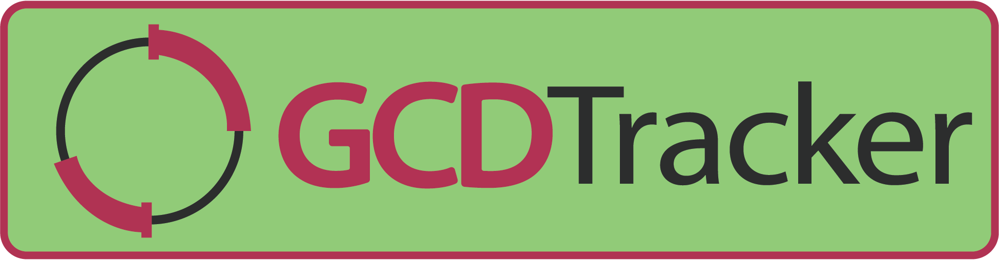
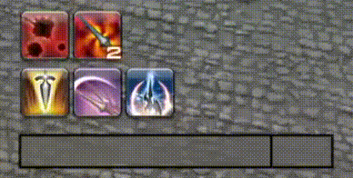

# GCDTracker
A plugin for goat's [XIVLauncher](https://github.com/goaaats/FFXIVQuickLauncher) that helps you learn the basics of combat, such as GCD and animation lock.
Once you enter combat, the plugin will show you a circle with the current status of your GCD, as well as a graph showing the current step in your combo. OGCDs will be added with their correspondent animation locks as they get pressed.

Now also available as a Bar and with optional "Always Be Casting" warnings.

## FAQ

### Why does the animation lock get longer immediately after appearing?
All skills have a default animation lock and later get an update from the server with the remaining animation lock length. this update accounts for the original lock + ping.

### Why won't the plugin show up in PVP?
In order to ensure fairness in the game gcdtracker is unavailable in PvP instances.

### All my spell casts are being marked as A-B-C, even when perfectly queued.
This migh happen due to ping, especially if playing on remote regions. You can adjust the "A-B-C alert delay" in the plugin settings to better fit your ping.

### What's the combo tracker?
It was a feature that allowed you to visualize combo routes, making it not neccesary to have the combo buttons on your bar. It is currently not maintained due to low use and high amount of work needed to keep it up to date each patch.

### Can I help by testing?
Please do! I don't have all the jobs leveled yet so I really appreciate testing, to do so:

- Add the following custom plugin repository to dalamud: `https://gist.githubusercontent.com/CaiClone/0aad66569dbf63a9bbeec6a8e95a123f/raw/pluginmaster.json`
- Report any issue you find to this repo.
